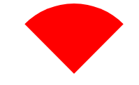
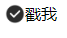
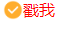
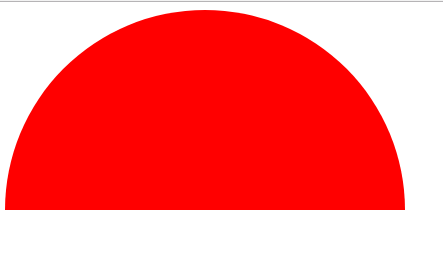
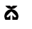
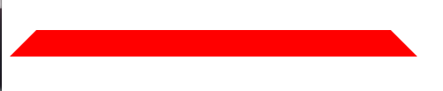

# geometric-figure
总结了几种常用的css画各种几何图形的方法！ 

### 用自定义的图片做边框
效果图 
  
[戳我](https://github.com/KuroNekoNyaa/geometric-figure/blob/master/border-image.html)
### 扇形
  
[戳我](https://github.com/KuroNekoNyaa/geometric-figure/blob/master/fan.html)
### 表单美化
这里checkbox为例 
点击前 
  
点击后 
  
[戳我](https://github.com/KuroNekoNyaa/geometric-figure/blob/master/.html) 
原理：将原生的input设置为display：none，然后给label添加自己的背景
### 半圆
  
[戳我](https://github.com/KuroNekoNyaa/geometric-figure/blob/master/semi-circle.html)
### background-position的过渡动画 
  
[戳我](https://github.com/KuroNekoNyaa/geometric-figure/blob/master/background-animation.html)

### 梯形
  
[戳我](https://github.com/KuroNekoNyaa/geometric-figure/blob/master/trapezoid.html)

### 三角形
  
[戳我](https://github.com/KuroNekoNyaa/geometric-figure/blob/master/triangle.html)
